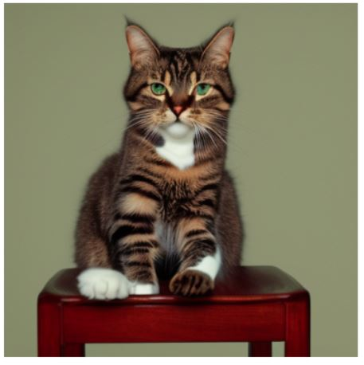
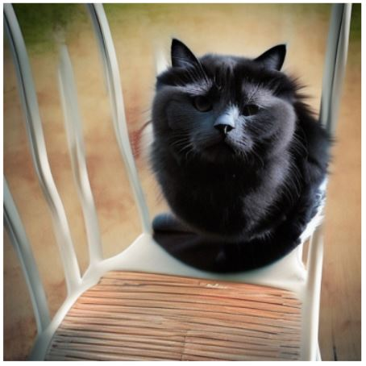
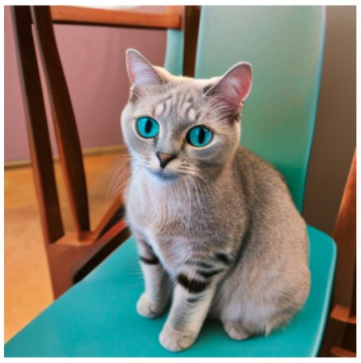
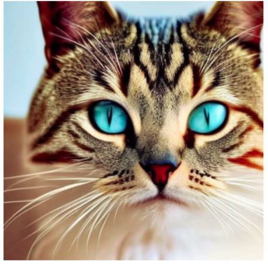
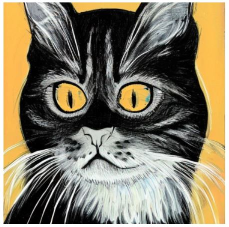

# Machine Learning Telephone (Game)
This project employs a variety of AI models, each with a distinct role:

**GPT-2 Model for Text Generation:** The GPT-2 model generates a continuation of a given text prompt. This text serves as the description that guides the image generation process. The model is a part of the Hugging Face's transformers library and is initialized with the pipeline('text-generation', model='gpt2-xl') command.

**RoBERTa Model for Zero-Shot Classification:** The RoBERTa model classifies a given piece of text into one of the provided labels. Although not directly used in the telephone game process, this model provides the capability to categorize text, which could be employed in more complex iterations of the game. It's initialized with pipeline('zero-shot-classification', model='roberta-large-mnli').

**Stable Diffusion Model for Image Generation:** This model generates an image from a given text prompt. The generated image serves as the basis for the next round in the telephone game, where the objects in the image are identified and used to generate the next text prompt. The model is provided by the stabilityai library and is used with the StableDiffusionPipeline.from_pretrained(model_id, scheduler=scheduler, torch_dtype=torch.float16) command.

**Object Detection Model:** This model identifies objects in a given image, returning bounding boxes and labels for each detected object. These labels then form the basis of the text prompt for the next round of the game. It's initialized with pipeline('object-detection').

These models work together to create a loop: a text prompt generates an image, objects in the image are identified and used to generate a new text prompt, and the cycle continues.

### Example of a game:
#### 1st Prompt: "A cat sitting on a chair"

#### 2nd Prompt: "cat chair."

#### 3rd Prompt: "chair cat has to be adopted by a new owner - a big responsibility to take on for a new arrival to a new home. There is also the"

#### 4th Prompt: "cat' --data="username=adm;password=secret;host=localuser;port=22" --output="brief.j"

#### 5th Prompt: "cat. There's definitely something going on, but I cannot see anything. There's nothing that looks like a human being"

